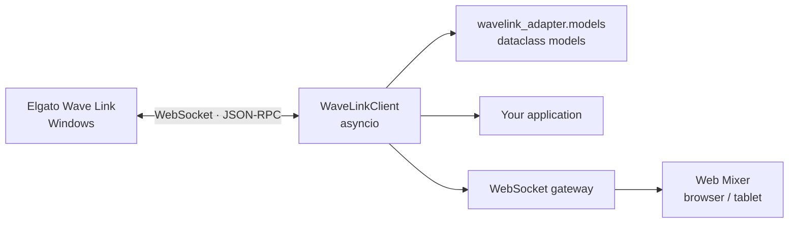

<div align="center">
  <p><strong>English</strong> · <a href="https://github.com/Nekit678/WaveLinkAdapter/blob/main/README.ru.md">Русский</a></p>
  
  <h1>WaveLinkAdapter</h1>
  <p><strong>An asynchronous Python client for the local Elgato Wave Link 3.x WebSocket / JSON-RPC API</strong></p>
  <p>
    <a href="https://pypi.org/project/wavelink-adapter/"></a>
    <a href="https://www.python.org/downloads/"></a>
    <a href="https://www.elgato.com/us/en/s/wave-link-app"></a>
    <a href="https://github.com/Nekit678/WaveLinkAdapter/actions/workflows/ci.yml"></a>
    <a href="https://github.com/Nekit678/WaveLinkAdapter/blob/main/LICENSE"></a>
  </p>
  <p>
    Control Wave Link channels, mixes, devices, effects, and subscriptions<br>
    from Python, WSL, or the included tablet-friendly web console.
  </p>
  <p>
    <a href="#quick-start">Quick start</a> ·
    <a href="https://pypi.org/project/wavelink-adapter/">PyPI</a> ·
    <a href="#web-mixer">Web Mixer</a> ·
    <a href="#api-overview">API</a> ·
    <a href="#development">Development</a>
  </p>
</div>

---

## About

`WaveLinkAdapter` connects to a running Elgato Wave Link instance,
automatically discovers its local WebSocket port, and exposes a convenient
asynchronous API backed by typed data models. It can serve as the foundation
for:

- Stream Deck integrations;
- REST APIs and WebSocket gateways;
- desktop applications;
- home automation;
- custom audio control surfaces.

The repository also includes **Web Mixer**, a responsive touch-friendly
console that runs in a browser without Node.js or a separate build step.

> [!NOTE]
> WaveLinkAdapter is an unofficial community project and is not affiliated with
> or endorsed by Elgato. Elgato and Wave Link are trademarks of their respective
> owners.

> [!IMPORTANT]
> The client has been tested with Elgato Wave Link `3.2.5.3731`, interface
> revision `2`. Wave Link's local API may change between application versions.

## Table of contents

- [Features](#features)
- [How it works](#how-it-works)
- [Requirements](#requirements)
- [Installation](#installation)
- [Quick start](#quick-start)
- [Web Mixer](#web-mixer)
- [Common use cases](#common-use-cases)
- [Events and state](#events-and-state)
- [Client configuration](#client-configuration)
- [API overview](#api-overview)
- [Error handling](#error-handling)
- [Tests](#tests)
- [Project structure](#project-structure)

## Features

| | Feature | What it provides |
|:--:|---|---|
| 🔎 | Automatic port discovery | Reads `ws-info.json` on Windows and WSL, then falls back to the Wave Link 3.x port range. |
| ⚡ | Asynchronous JSON-RPC | Concurrent requests, per-call timeouts, and correct response correlation. |
| 🔁 | Automatic reconnection | Exponential backoff with subscription and plugin metadata restoration. |
| 🎚️ | Mixer control | Channels, mixes, inputs, outputs, mute, levels, routing, and effects. |
| 📡 | Event support | Raw and typed handlers, plus asynchronous event streams. |
| 🧩 | Typed models | `dataclass` schemas, input validation, and preservation of unknown API fields. |
| 📚 | IDE documentation | Detailed docstrings for every public class, method, model, result, and error. |
| 🛠️ | Low-level access | A universal `call()` method for RPC methods without a dedicated wrapper. |
| 📱 | Web interface | A ready-to-use local mixer for desktop and tablet browsers. |

## How it works



For short-lived scripts, open the client with `async with`. Server applications
should create one `WaveLinkClient` instance and keep it alive for the lifetime
of the process.

## Requirements

- Python `3.11+`;
- Elgato Wave Link `3.x` running on Windows;
- `websockets>=16,<17`;
- Windows or WSL for automatic discovery of the local Wave Link instance.

Python 3.11 is required because the client uses `asyncio.timeout()`.

## Installation

Install the released library from PyPI:

```bash
python -m pip install wavelink-adapter
```

To work on the project from source, clone the repository and create a virtual
environment:

```bash
git clone https://github.com/Nekit678/WaveLinkAdapter.git
cd WaveLinkAdapter
python -m venv .venv
```

<details>
<summary><strong>Windows PowerShell</strong></summary>

```powershell
.venv\Scripts\Activate.ps1
python -m pip install --upgrade pip
python -m pip install -e ".[dev]"
```

</details>

<details>
<summary><strong>Linux / WSL</strong></summary>

```bash
source .venv/bin/activate
python -m pip install --upgrade pip
python -m pip install -e ".[dev]"
```

</details>

Start Wave Link before connecting. When running inside WSL, the client
automatically searches mounted Windows drives for `ws-info.json`.

## Quick start

```python
import asyncio

from wavelink_adapter import WaveLinkClient


async def main() -> None:
    async with WaveLinkClient() as client:
        info = await client.get_application_info()
        print(f"Wave Link {info.version}")

        for channel in await client.get_channels():
            print(channel.id, channel.name, channel.is_muted)


asyncio.run(main())
```

The context manager calls `connect()` when entering the block and `close()`
when leaving it, including when an exception is raised.

### Long-lived client

```python
from wavelink_adapter import WaveLinkClient


client = WaveLinkClient(
    host="127.0.0.1",
    rpc_timeout=5.0,
    auto_reconnect=True,
)


async def application_startup() -> None:
    await client.connect()


async def application_shutdown() -> None:
    await client.close()
```

Do not create a new WebSocket connection for every HTTP request. A single
client can safely handle multiple concurrent RPC calls.

## Web Mixer

The ready-to-run example lives in
[`examples/web_mixer`](https://github.com/Nekit678/WaveLinkAdapter/tree/main/examples/web_mixer).
It starts a Python gateway, serves the bundled web interface, and shares one
Wave Link connection across all connected browsers. The Web Mixer is available
in a source checkout and isn't installed by the core library wheel.

```bash
python -m examples.web_mixer.server
```

Once the server starts, open **<http://127.0.0.1:8765>**.

Web Mixer supports:

- per-mix channel levels and mute controls;
- input, output, and main-output management;
- software, VST, and hardware DSP effects;
- gain, gain lock, and Mic/PC balance;
- application routing between channels;
- live stereo level meters;
- automatic reconnection and meter subscription restoration.

### Tablet access

On a trusted local network, listen on all interfaces:

```bash
python -m examples.web_mixer.server --host 0.0.0.0
```

Then open `http://COMPUTER-IP:8765` on the tablet. Private addresses from
`10.0.0.0/8`, `172.16.0.0/12`, and `192.168.0.0/16` are allowed by default.

Additional server options:

```bash
python -m examples.web_mixer.server \
  --host 127.0.0.1 \
  --port 9000 \
  --allow-origin http://localhost:5173
```

| Option | Purpose |
|---|---|
| `--host` | Interface on which the gateway listens. |
| `--port` | Shared HTTP and WebSocket port; defaults to `8765`. |
| `--wavelink-host` | Host that exposes the Wave Link RPC endpoint. |
| `--allow-origin` | Allowed browser Origin; may be specified more than once. |
| `--no-web-ui` | Run the WebSocket gateway without serving the web client. |
| `--debug` | Enable verbose logging. |

> [!WARNING]
> `--allow-origin '*'` disables Origin validation. Do not expose the gateway to
> the public internet without separate authentication and a TLS proxy.

## Common use cases

### Reading mixer state

```python
async with WaveLinkClient() as client:
    inputs = await client.get_input_devices()
    outputs = await client.get_output_devices()
    channels = await client.get_channels()
    mixes = await client.get_mixes()

    for channel in channels:
        print("channel", channel.id, channel.name)

    for mix in mixes:
        print("mix", mix.id, mix.name)
```

Always use identifiers returned by Wave Link. They depend on the current device
and mixer configuration.

### Controlling channels and mixes

```python
await client.set_channel_level(channel_id, 0.5)
await client.set_channel_mute(channel_id, True)
await client.set_channel_mix_level(channel_id, mix_id, 0.75)
await client.set_channel_mix_mute(channel_id, mix_id, False)
await client.set_channel_effect_enabled(channel_id, effect_id, True)

await client.set_mix_level(mix_id, 0.9)
await client.set_mix_mute(mix_id, False)
```

### Controlling inputs and outputs

```python
await client.set_input_mute(device_id, input_id, True)
await client.set_input_gain(device_id, input_id, 0.65)
await client.set_input_gain_lock(device_id, input_id, True)
await client.set_input_mic_pc_mix(device_id, input_id, 0.5)
await client.set_input_effect_enabled(device_id, input_id, effect_id, True)

await client.set_output_level(output_device_id, output_id, 0.8)
await client.set_output_mute(output_device_id, output_id, False)
await client.set_output_mix(output_device_id, output_id, mix_id)
await client.set_main_output(output_device_id, output_id)
```

Levels use values from `0.0` to `1.0`. Convenience methods clamp values to that
range and reject `NaN`, infinity, and `bool` values.

### Typed models

High-level methods return `dataclass` objects from `wavelink_adapter` instead of
raw JSON dictionaries. Fields use idiomatic `snake_case` names:

```python
channels = await client.get_channels()
channel = channels[0]

print(channel.id, channel.name, channel.is_muted)
for mix in channel.mixes or []:
    print(mix.identifier, mix.level)
```

Every schema supports conversion in both directions:

```python
from wavelink_adapter import ChannelUpdate


update = ChannelUpdate(id="channel-id", level=0.5, is_muted=False)
print(update.to_dict())
# {'id': 'channel-id', 'level': 0.5, 'isMuted': False}
```

Required fields, types, and nested structures are validated while parsing.
Unknown fields introduced by newer Wave Link versions are retained in `extra`,
so they survive a serialization round trip.

### Low-level RPC

Use `call()` for an RPC method that has no dedicated wrapper:

```python
result = await client.call("getChannels")

result = await client.call(
    "someMethod",
    {"id": "target-id"},
    timeout=2.0,
)
```

`call()` accepts and returns ordinary JSON values and does not validate a
method-specific response contract.

## Events and state

A raw event handler receives the original notification parameters:

```python
def on_focused_app(params: dict) -> None:
    print("Focused application:", params)


client.on("focusedAppChanged", on_focused_app)
await client.subscribe_focused_app()
```

Known events also support typed handlers:

```python
from wavelink_adapter import FocusedAppChanged


def on_focused_app(event: FocusedAppChanged) -> None:
    print(event.name)


client.on_typed("focusedAppChanged", on_focused_app)
```

Or consume level meter events as an asynchronous stream:

```python
await client.subscribe_level_meter("channel", channel_id)

async for meters in client.stream_level_meters(queue_size=64):
    for meter in meters.channels or []:
        print(meter.id, meter.level_left_percentage)
```

`stream_events()`, `stream_focused_app_changes()`, and
`stream_input_device_changes()` are also available. Remove registered handlers
with `off()` and `off_typed()`.

The latest known state is cached in `application_info`, `input_devices`,
`output_devices`, `main_output`, `channels`, `mixes`, `level_meters`, and
`focused_app`.

### Reconnection behavior

After an established connection is lost, the client automatically:

1. retries the connection with exponential backoff;
2. restores the latest value passed to `set_plugin_info()`;
3. re-enables remembered subscriptions.

An RPC request that was in flight when the connection failed raises
`WaveLinkDisconnectedError` and is not replayed automatically. This prevents
state-changing operations from running twice. An explicit `close()` disables
reconnection.

## Client configuration

```python
client = WaveLinkClient(
    host="127.0.0.1",
    debug=False,
    rpc_timeout=10.0,
    open_timeout=3.0,
    close_timeout=3.0,
    event_queue_size=256,
    auto_reconnect=True,
    reconnect_initial_delay=0.5,
    reconnect_max_delay=10.0,
    reconnect_backoff=2.0,
)
```

| Parameter | Default | Purpose |
|---|:---:|---|
| `host` | `127.0.0.1` | Host on which Wave Link is available. |
| `debug` | `False` | Log incoming and outgoing WebSocket messages. |
| `rpc_timeout` | `10.0` | RPC timeout; `None` disables it. |
| `open_timeout` | `3.0` | Timeout for opening one connection. |
| `close_timeout` | `3.0` | Timeout for closing the connection. |
| `event_queue_size` | `256` | Maximum size of the internal event queue. |
| `auto_reconnect` | `True` | Reconnect after an established connection is lost. |
| `reconnect_initial_delay` | `0.5` | Initial delay between reconnect attempts. |
| `reconnect_max_delay` | `10.0` | Maximum reconnect delay. |
| `reconnect_backoff` | `2.0` | Delay multiplier after each failed attempt. |

To inspect the WebSocket exchange, configure Python's standard `logging`
module:

```python
import logging

logging.basicConfig(level=logging.DEBUG)
client = WaveLinkClient(debug=True)
```

## API overview

| Category | Methods |
|---|---|
| Connection | `connect`, `close`, `wait_until_connected`, `discover_ports` |
| Reading | `get_application_info`, `get_input_devices`, `get_output_devices`, `get_channels`, `get_mixes` |
| Inputs | `set_input_device`, `set_input_mute`, `set_input_gain`, `set_input_gain_lock`, `set_input_mic_pc_mix`, `set_input_effect_enabled` |
| Outputs | `set_output_device`, `set_main_output`, `set_output_level`, `set_output_mute`, `set_output_mix`, `remove_output_from_mix` |
| Channels | `set_channel`, `set_channel_level`, `set_channel_mute`, `set_channel_mix_level`, `set_channel_mix_mute`, `set_channel_effect_enabled`, `add_to_channel` |
| Mixes | `set_mix`, `set_mix_level`, `set_mix_mute` |
| Events | `on`, `off`, `on_typed`, `off_typed`, `stream_events`, and specialized stream methods |
| Subscriptions | `set_subscription`, `subscribe_focused_app`, `subscribe_level_meter`, `subscribe_realtime`, `try_subscribe_level_meters` |
| Integrations | `set_plugin_info`, `call` |

Setter methods accept typed update schemas. Raw JSON dictionaries are only used
at the `call()` and transport layers.

## Error handling

```python
from wavelink_adapter import (
    WaveLinkDisconnectedError,
    WaveLinkProtocolError,
    WaveLinkRpcError,
    WaveLinkTimeoutError,
)


try:
    await client.set_channel_level(channel_id, 0.5)
except WaveLinkTimeoutError as exc:
    print("Wave Link did not respond:", exc)
except WaveLinkDisconnectedError as exc:
    print("Connection lost:", exc)
except WaveLinkRpcError as exc:
    print("RPC error:", exc.code, exc.message, exc.data)
except WaveLinkProtocolError as exc:
    print("Unexpected response shape:", exc)
```

| Exception | Cause |
|---|---|
| `WaveLinkRpcError` | Wave Link returned a JSON-RPC `error`. |
| `WaveLinkProtocolError` | The response does not match the expected contract. |
| `WaveLinkDisconnectedError` | The connection is unavailable or was lost. |
| `WaveLinkTimeoutError` | An RPC call or reconnect wait timed out. |
| `ConnectionError` | The client could not connect to any discovered port. |

## Tests

```bash
python -m unittest discover -v
```

The automated tests do not require a running Wave Link instance; they emulate
the transport and API responses.

## Project structure

```text
WaveLinkAdapter/
├── pyproject.toml                # Build and package metadata
├── LICENSE                       # MIT license
├── src/
│   └── wavelink_adapter/
│       ├── __init__.py           # Public API
│       ├── client.py             # WebSocket transport and WaveLinkClient
│       ├── models.py             # Typed API models
│       └── py.typed              # PEP 561 typing marker
├── tests/
│   ├── test_client.py            # Core test suite
│   └── test_documentation.py     # Public docstring coverage
└── examples/
    └── web_mixer/
        ├── server.py             # HTTP / WebSocket gateway
        ├── test_server.py
        └── web/                  # Build-free HTML, CSS, and JavaScript
```

## Development

Before submitting changes, run:

```bash
python -m unittest discover -v
python -m compileall src tests examples
python -m build
python -m twine check dist/*
```

Release publishing is automated through GitHub Actions and PyPI Trusted
Publishing. See the [release guide](https://github.com/Nekit678/WaveLinkAdapter/blob/main/RELEASING.md)
for the one-time setup and versioning procedure.

Issues and pull requests are welcome. When changing the RPC contract, include a
test that captures the new request or response shape and mention the Wave Link
version used for verification.

---

<div align="center">
  Built for local integrations with Elgato Wave Link.
</div>
