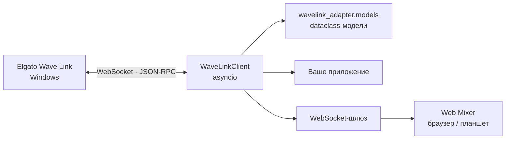

<div align="center">
  <p><a href="https://github.com/Nekit678/WaveLinkAdapter/blob/main/README.md">English</a> · <strong>Русский</strong></p>
  
  <h1>WaveLinkAdapter</h1>
  <p><strong>Асинхронный Python-клиент для локального WebSocket / JSON-RPC API Elgato Wave Link 3.x</strong></p>
  <p>
    <a href="https://www.python.org/downloads/"></a>
    <a href="https://www.elgato.com/us/en/s/wave-link-app"></a>
    <a href="https://docs.python.org/3/library/asyncio.html"></a>
    <a href="https://github.com/Nekit678/WaveLinkAdapter/commits/main"></a>
  </p>
  <p>
    Управляйте каналами, миксами, устройствами, эффектами и подписками Wave Link<br>
    из Python, WSL или готовой web-консоли для планшета.
  </p>
  <p>
    <a href="#быстрый-старт">Быстрый старт</a> ·
    <a href="#web-mixer">Web Mixer</a> ·
    <a href="#карта-api">API</a> ·
    <a href="#разработка">Разработка</a>
  </p>
</div>

---

## О проекте

`WaveLinkAdapter` подключается к запущенному Elgato Wave Link, автоматически
находит его локальный WebSocket-порт и предоставляет удобный асинхронный API с
типизированными моделями данных. Проект можно использовать как основу для:

- интеграции со Stream Deck;
- REST API или WebSocket-шлюза;
- настольного приложения;
- домашней автоматизации;
- собственного интерфейса управления звуком.

В репозитории также есть готовый **Web Mixer** — адаптивная сенсорная консоль,
которая работает в браузере без Node.js и отдельной сборки.

> [!IMPORTANT]
> Клиент проверен с Elgato Wave Link `3.2.5.3731`, interface revision `2`.
> Локальный API Wave Link может изменяться между версиями приложения.

## Содержание

- [Возможности](#возможности)
- [Как это работает](#как-это-работает)
- [Требования](#требования)
- [Установка](#установка)
- [Быстрый старт](#быстрый-старт)
- [Web Mixer](#web-mixer)
- [Основные сценарии](#основные-сценарии)
- [События и состояние](#события-и-состояние)
- [Настройка клиента](#настройка-клиента)
- [Карта API](#карта-api)
- [Обработка ошибок](#обработка-ошибок)
- [Инструменты и тесты](#инструменты-и-тесты)
- [Структура проекта](#структура-проекта)

## Возможности

| | Возможность | Что даёт |
|:--:|---|---|
| 🔎 | Автопоиск порта | Чтение `ws-info.json` в Windows и WSL с резервным поиском по портам Wave Link 3.x. |
| ⚡ | Асинхронный JSON-RPC | Параллельные запросы, индивидуальные таймауты и корректное сопоставление ответов. |
| 🔁 | Переподключение | Экспоненциальная задержка и восстановление подписок и метаданных плагина. |
| 🎚️ | Управление микшером | Каналы, миксы, входы, выходы, mute, уровни, маршрутизация и эффекты. |
| 📡 | События | Обычные и типизированные обработчики, а также асинхронные потоки событий. |
| 🧩 | Типизированные модели | `dataclass`-схемы, проверка входных данных и сохранение неизвестных полей API. |
| 🛠️ | Низкоуровневый доступ | Универсальный `call()` для методов, у которых ещё нет готовой обёртки. |
| 📱 | Web-интерфейс | Готовый локальный микшер для компьютера или планшета. |

## Как это работает



Для коротких сценариев клиент удобно открывать через `async with`. В серверном
приложении лучше создать один экземпляр `WaveLinkClient` и использовать его всё
время работы процесса.

## Требования

- Python `3.11+`;
- Elgato Wave Link `3.x`, запущенный в Windows;
- `websockets>=16,<17`;
- Windows или WSL для автоматического поиска локального экземпляра Wave Link.

Python 3.11 требуется из-за использования `asyncio.timeout()`.

## Установка

Установите выпущенную библиотеку из PyPI:

```bash
python -m pip install wavelink-adapter
```

Для разработки из исходников клонируйте репозиторий и создайте виртуальное
окружение:

```bash
git clone https://github.com/Nekit678/WaveLinkAdapter.git
cd WaveLinkAdapter
python -m venv .venv
```

<details>
<summary><strong>Windows PowerShell</strong></summary>

```powershell
.venv\Scripts\Activate.ps1
python -m pip install --upgrade pip
python -m pip install -e ".[dev]"
```

</details>

<details>
<summary><strong>Linux / WSL</strong></summary>

```bash
source .venv/bin/activate
python -m pip install --upgrade pip
python -m pip install -e ".[dev]"
```

</details>

Перед подключением запустите Wave Link. В WSL клиент найдёт `ws-info.json` на
смонтированных Windows-дисках автоматически.

## Быстрый старт

```python
import asyncio

from wavelink_adapter import WaveLinkClient


async def main() -> None:
    async with WaveLinkClient() as client:
        info = await client.get_application_info()
        print(f"Wave Link {info.version}")

        for channel in await client.get_channels():
            print(channel.id, channel.name, channel.is_muted)


asyncio.run(main())
```

Контекстный менеджер сам вызывает `connect()` при входе и `close()` при выходе,
в том числе если внутри блока возникло исключение.

### Долгоживущий клиент

```python
from wavelink_adapter import WaveLinkClient


client = WaveLinkClient(
    host="127.0.0.1",
    rpc_timeout=5.0,
    auto_reconnect=True,
)


async def application_startup() -> None:
    await client.connect()


async def application_shutdown() -> None:
    await client.close()
```

Не создавайте новое WebSocket-соединение для каждого HTTP-запроса: один клиент
умеет безопасно обслуживать несколько одновременных RPC-вызовов.

## Web Mixer

Готовый пример находится в
[`examples/web_mixer`](https://github.com/Nekit678/WaveLinkAdapter/tree/main/examples/web_mixer).
Он запускает Python-шлюз, раздаёт встроенный web-интерфейс и использует одно
общее соединение с Wave Link для всех браузеров. Web Mixer доступен в клоне
репозитория и не устанавливается вместе с wheel основной библиотеки.

```bash
python -m examples.web_mixer.server
```

После запуска откройте **<http://127.0.0.1:8765>**.

Web Mixer поддерживает:

- уровни и mute каналов для каждого микса;
- управление входами, выходами и главным выходом;
- программные, VST- и аппаратные DSP-эффекты;
- gain, gain lock и баланс Mic/PC;
- маршрутизацию приложений между каналами;
- живые стереоиндикаторы уровней;
- автоматическое переподключение и восстановление meter-подписок.

### Доступ с планшета

В доверенной локальной сети запустите сервер на всех интерфейсах:

```bash
python -m examples.web_mixer.server --host 0.0.0.0
```

Затем откройте на планшете `http://IP-КОМПЬЮТЕРА:8765`. Локальные адреса из
диапазонов `10.0.0.0/8`, `172.16.0.0/12` и `192.168.0.0/16` разрешены по
умолчанию.

Дополнительные параметры сервера:

```bash
python -m examples.web_mixer.server \
  --host 127.0.0.1 \
  --port 9000 \
  --allow-origin http://localhost:5173
```

| Параметр | Назначение |
|---|---|
| `--host` | Интерфейс для прослушивания. |
| `--port` | HTTP- и WebSocket-порт, по умолчанию `8765`. |
| `--wavelink-host` | Хост с доступным Wave Link RPC. |
| `--allow-origin` | Разрешённый Origin; параметр можно повторять. |
| `--no-web-ui` | Запустить только WebSocket-шлюз. |
| `--debug` | Включить подробное журналирование. |

> [!WARNING]
> Значение `--allow-origin '*'` отключает проверку Origin. Не публикуйте шлюз в
> интернет без отдельной аутентификации и TLS-прокси.

## Основные сценарии

### Получение состояния

```python
async with WaveLinkClient() as client:
    inputs = await client.get_input_devices()
    outputs = await client.get_output_devices()
    channels = await client.get_channels()
    mixes = await client.get_mixes()

    for channel in channels:
        print("channel", channel.id, channel.name)

    for mix in mixes:
        print("mix", mix.id, mix.name)
```

Используйте идентификаторы, полученные от Wave Link: они зависят от текущей
конфигурации устройств и микшера.

### Управление каналами и миксами

```python
await client.set_channel_level(channel_id, 0.5)
await client.set_channel_mute(channel_id, True)
await client.set_channel_mix_level(channel_id, mix_id, 0.75)
await client.set_channel_mix_mute(channel_id, mix_id, False)
await client.set_channel_effect_enabled(channel_id, effect_id, True)

await client.set_mix_level(mix_id, 0.9)
await client.set_mix_mute(mix_id, False)
```

### Управление входами и выходами

```python
await client.set_input_mute(device_id, input_id, True)
await client.set_input_gain(device_id, input_id, 0.65)
await client.set_input_gain_lock(device_id, input_id, True)
await client.set_input_mic_pc_mix(device_id, input_id, 0.5)
await client.set_input_effect_enabled(device_id, input_id, effect_id, True)

await client.set_output_level(output_device_id, output_id, 0.8)
await client.set_output_mute(output_device_id, output_id, False)
await client.set_output_mix(output_device_id, output_id, mix_id)
await client.set_main_output(output_device_id, output_id)
```

Уровни задаются числами от `0.0` до `1.0`. Методы быстрого доступа ограничивают
значения этим диапазоном; `NaN`, бесконечность и `bool` отклоняются.

### Типизированные модели

Высокоуровневые методы возвращают `dataclass`-объекты из `wavelink_adapter`, а не
исходные JSON-словари. Имена полей представлены в привычном `snake_case`:

```python
channels = await client.get_channels()
channel = channels[0]

print(channel.id, channel.name, channel.is_muted)
for mix in channel.mixes or []:
    print(mix.identifier, mix.level)
```

Каждая схема поддерживает преобразование в обе стороны:

```python
from wavelink_adapter import ChannelUpdate


update = ChannelUpdate(id="channel-id", level=0.5, is_muted=False)
print(update.to_dict())
# {'id': 'channel-id', 'level': 0.5, 'isMuted': False}
```

При разборе проверяются обязательные поля, типы и вложенные структуры.
Неизвестные поля новой версии Wave Link сохраняются в `extra`, поэтому они не
теряются при обратной сериализации.

### Низкоуровневый RPC

Для метода без готовой обёртки используйте `call()`:

```python
result = await client.call("getChannels")

result = await client.call(
    "someMethod",
    {"id": "target-id"},
    timeout=2.0,
)
```

`call()` принимает и возвращает обычные JSON-значения и не проверяет контракт
конкретного метода.

## События и состояние

Обычный обработчик получает исходные параметры уведомления:

```python
def on_focused_app(params: dict) -> None:
    print("Focused application:", params)


client.on("focusedAppChanged", on_focused_app)
await client.subscribe_focused_app()
```

Для известных событий доступен типизированный вариант:

```python
from wavelink_adapter import FocusedAppChanged


def on_focused_app(event: FocusedAppChanged) -> None:
    print(event.name)


client.on_typed("focusedAppChanged", on_focused_app)
```

Или асинхронный поток level meter:

```python
await client.subscribe_level_meter("channel", channel_id)

async for meters in client.stream_level_meters(queue_size=64):
    for meter in meters.channels or []:
        print(meter.id, meter.level_left_percentage)
```

Также доступны `stream_events()`, `stream_focused_app_changes()` и
`stream_input_device_changes()`. Обработчики удаляются через `off()` и
`off_typed()`.

Последнее состояние сохраняется в свойствах `application_info`,
`input_devices`, `output_devices`, `main_output`, `channels`, `mixes`,
`level_meters` и `focused_app`.

### Переподключение

После потери уже установленного соединения клиент автоматически:

1. повторяет подключение с экспоненциальной задержкой;
2. восстанавливает последнее значение `set_plugin_info()`;
3. повторно включает сохранённые подписки.

RPC-запрос, выполнявшийся в момент обрыва, завершается
`WaveLinkDisconnectedError` и не повторяется автоматически — это защищает от
двойного выполнения изменяющих операций. Явный `close()` отключает реконнект.

## Настройка клиента

```python
client = WaveLinkClient(
    host="127.0.0.1",
    debug=False,
    rpc_timeout=10.0,
    open_timeout=3.0,
    close_timeout=3.0,
    event_queue_size=256,
    auto_reconnect=True,
    reconnect_initial_delay=0.5,
    reconnect_max_delay=10.0,
    reconnect_backoff=2.0,
)
```

| Параметр | По умолчанию | Назначение |
|---|:---:|---|
| `host` | `127.0.0.1` | Хост, на котором доступен Wave Link. |
| `debug` | `False` | Журналирование исходящих и входящих сообщений. |
| `rpc_timeout` | `10.0` | Таймаут RPC; `None` отключает его. |
| `open_timeout` | `3.0` | Таймаут открытия одного соединения. |
| `close_timeout` | `3.0` | Таймаут закрытия соединения. |
| `event_queue_size` | `256` | Размер внутренней очереди событий. |
| `auto_reconnect` | `True` | Переподключение после потери связи. |
| `reconnect_initial_delay` | `0.5` | Начальная задержка реконнекта. |
| `reconnect_max_delay` | `10.0` | Максимальная задержка реконнекта. |
| `reconnect_backoff` | `2.0` | Множитель задержки между попытками. |

Для просмотра WebSocket-обмена настройте стандартный `logging`:

```python
import logging

logging.basicConfig(level=logging.DEBUG)
client = WaveLinkClient(debug=True)
```

## Карта API

| Категория | Методы |
|---|---|
| Соединение | `connect`, `close`, `wait_until_connected`, `discover_ports` |
| Чтение | `get_application_info`, `get_input_devices`, `get_output_devices`, `get_channels`, `get_mixes` |
| Входы | `set_input_device`, `set_input_mute`, `set_input_gain`, `set_input_gain_lock`, `set_input_mic_pc_mix`, `set_input_effect_enabled` |
| Выходы | `set_output_device`, `set_main_output`, `set_output_level`, `set_output_mute`, `set_output_mix`, `remove_output_from_mix` |
| Каналы | `set_channel`, `set_channel_level`, `set_channel_mute`, `set_channel_mix_level`, `set_channel_mix_mute`, `set_channel_effect_enabled`, `add_to_channel` |
| Миксы | `set_mix`, `set_mix_level`, `set_mix_mute` |
| События | `on`, `off`, `on_typed`, `off_typed`, `stream_events` и специализированные stream-методы |
| Подписки | `set_subscription`, `subscribe_focused_app`, `subscribe_level_meter`, `subscribe_realtime`, `try_subscribe_level_meters` |
| Интеграции | `set_plugin_info`, `call` |

Setter-методы принимают типизированные update-схемы. Обычные JSON-словари
используются только на уровне `call()` и транспорта.

## Обработка ошибок

```python
from wavelink_adapter import (
    WaveLinkDisconnectedError,
    WaveLinkProtocolError,
    WaveLinkRpcError,
    WaveLinkTimeoutError,
)


try:
    await client.set_channel_level(channel_id, 0.5)
except WaveLinkTimeoutError as exc:
    print("Wave Link не ответил:", exc)
except WaveLinkDisconnectedError as exc:
    print("Соединение потеряно:", exc)
except WaveLinkRpcError as exc:
    print("RPC error:", exc.code, exc.message, exc.data)
except WaveLinkProtocolError as exc:
    print("Неожиданная структура ответа:", exc)
```

| Исключение | Причина |
|---|---|
| `WaveLinkRpcError` | Wave Link вернул JSON-RPC `error`. |
| `WaveLinkProtocolError` | Ответ не соответствует ожидаемому контракту. |
| `WaveLinkDisconnectedError` | Соединение отсутствует или было потеряно. |
| `WaveLinkTimeoutError` | Истёк таймаут RPC или ожидания реконнекта. |
| `ConnectionError` | Не удалось подключиться ни к одному найденному порту. |

## Инструменты и тесты

### Консольный тестер методов

Посмотреть доступные методы:

```bash
python wavelink_method_tester.py --list-methods
```

Вызвать безопасный метод чтения:

```bash
python wavelink_method_tester.py get_channels
```

Изменяющие методы требуют явного флага `--live`:

```bash
python wavelink_method_tester.py set_channel_level \
  --args '["CHANNEL_ID", 0.5]' \
  --live
```

### Автоматические тесты

```bash
python -m unittest discover -v
```

Тесты не требуют запущенного Wave Link: транспорт и ответы API эмулируются.

> [!CAUTION]
> `live_wavelink_integration.py` изменяет состояние реального микшера и затем
> пытается восстановить его. Запускайте этот сценарий только осознанно.

## Структура проекта

```text
WaveLinkAdapter/
├── pyproject.toml                # Метаданные сборки и пакета
├── LICENSE                       # Лицензия MIT
├── src/
│   └── wavelink_adapter/
│       ├── __init__.py           # Публичный API
│       ├── client.py             # WebSocket-транспорт и WaveLinkClient
│       ├── models.py             # Типизированные модели API
│       └── py.typed              # Маркер типизации PEP 561
├── tests/
│   └── test_client.py            # Тесты ядра
├── wavelink_method_tester.py     # CLI для проверки публичных методов
├── live_wavelink_integration.py  # Проверка с реальным Wave Link
└── examples/
    └── web_mixer/
        ├── server.py             # HTTP / WebSocket-шлюз
        ├── test_server.py
        └── web/                  # HTML, CSS и JavaScript без сборщика
```

## Разработка

Перед отправкой изменений:

```bash
python -m unittest discover -v
python -m compileall src tests examples
python -m build
python -m twine check dist/*
```

Публикация релизов автоматизирована через GitHub Actions и PyPI Trusted
Publishing. Однократная настройка и порядок выпуска описаны в
[инструкции по релизам](https://github.com/Nekit678/WaveLinkAdapter/blob/main/RELEASING.md).

Issues и pull request'ы приветствуются. При изменении RPC-контракта добавьте
тест, который фиксирует новую форму запроса или ответа, и укажите версию Wave
Link, на которой она была проверена.

---

<div align="center">
  Сделано для локальных интеграций с Elgato Wave Link.
</div>
